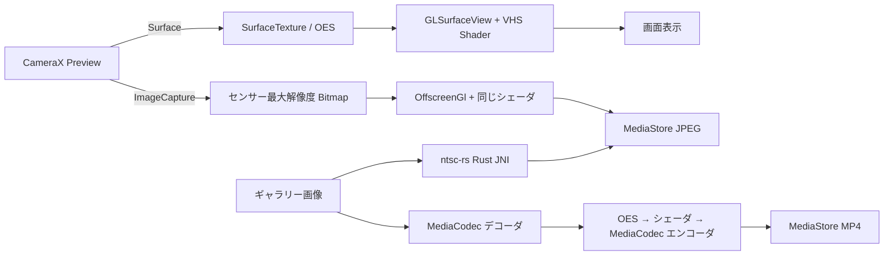

<div align="center">

# RetroVHS

### Android 向け VHS / NTSC エフェクトカメラ

[](app/build.gradle.kts)
[](rust/ntscrs-jni/Cargo.toml)
[](app/build.gradle.kts)
[](app/build.gradle.kts)
[](LICENSE)

**カメラとギャラリーに VHS / NTSC エフェクトを焼き込み、日時スタンプ付きの 90 年代風映像を 1 タップで作るアプリ**

---

</div>

## 概要

スマホのカメラやギャラリー画像／動画に対し、VHS テープ・NTSC 放送特有の劣化（クロマブラー、走査線、テープグレイン、色収差、ドロップアウト）を**リアルタイム**で適用する Android アプリ。撮影画像は端末センサー最大解像度で取得し、同じシェーダで処理して保存するため**プレビューと結果が完全一致**。

シェーダで実時間処理する一方、ギャラリー画像のオフライン処理には Rust 製の [ntsc-rs](https://github.com/ntsc-rs/ntsc-rs) を JNI 経由で呼び出して高品質な NTSC エミュレーションを実行。

## 特徴

| 機能 | 内容 |
| --- | --- |
| ライブカメラ | OpenGL ES 3.0 シェーダで 60fps プレビュー、写真 / 動画両対応 |
| ギャラリー処理 | 既存の画像 / 動画を選んで VHS 加工して MediaStore に保存 |
| 高品質モード | 画像のみ ntsc-rs (Rust) で本格 NTSC エミュレーション |
| シェーダプリセット | クリーン / 弱VHS / VHS 90s / 壊れたテープ / 高画質 |
| シェーダバリアント | オフ / ソフト / 標準 / ノイジー / シネマ |
| 色フィルタ | なし / セピア / モノクロ / ブルー / レッド / グリーン / ナイト / 色褪せ |
| 日時スタンプ | VCR OSD Mono フォントで焼き込み、4 隅 + 4 段階回転 |
| 設定永続化 | DataStore Preferences で全設定を保存 |
| 多言語 UI | 日本語 / 英語のホットスイッチ |
| 動画録画 | H.264 + AAC + MP4 (MediaCodec + MediaMuxer) |
| アスペクト比 | 4:3 / 16:9 / 1:1、Preview と ImageCapture が共有 ViewPort で完全一致 |

## 処理フロー



## インストール

### 必要環境

| ツール | バージョン |
| --- | --- |
| Android Studio | Hedgehog 以降 |
| JDK | 17 以上 |
| Android SDK | 34, NDK 27 系 |
| Rust | 1.85 以上 (edition 2021) |
| cargo-ndk | `cargo install cargo-ndk` |

Rust ターゲットの追加:

```bash
rustup target add aarch64-linux-android armv7-linux-androideabi x86_64-linux-android i686-linux-android
```

### ビルド

```bash
git clone https://github.com/cUDGk/retrovhs-android.git
cd retrovhs-android
./gradlew assembleDebug
```

`preBuild` から `cargoNdkBuild` タスクが自動的に走り、`rust/ntscrs-jni` を 4 アーキ (arm64-v8a / armeabi-v7a / x86_64 / x86) でクロスコンパイルして `app/src/main/jniLibs/` に配置する。

最小: Android 8.0 (API 26) / Target: Android 14 (API 34)

## 使い方

1. ホームから `CAMERA` を選択
2. 画面下のチューンアイコンで設定パネル展開
3. プリセット / シェーダバリアント / 強度 / 画質 / アスペクト比を選択
4. シャッターボタンで撮影 (写真 / 動画モード切替可)
5. ギャラリー処理は `GALLERY` から既存画像／動画を選択
6. 日時スタンプ ON にすると VCR OSD Mono フォントで右下に焼き込み

UI 言語は `LANGUAGE` ボタンでトグル（日本語 ⇄ English）。

## Attribution

本アプリの NTSC エミュレーションは [ntsc-rs](https://github.com/ntsc-rs/ntsc-rs) (MIT / Apache-2.0 / ISC) を依存ライブラリとして使用している。改変は行っていない。

その他の依存 OSS およびライセンス全文は [`THIRD_PARTY_LICENSES.md`](THIRD_PARTY_LICENSES.md) を参照。

## ライセンス

[MIT](LICENSE)。Copyright (c) 2026 cUDGk
